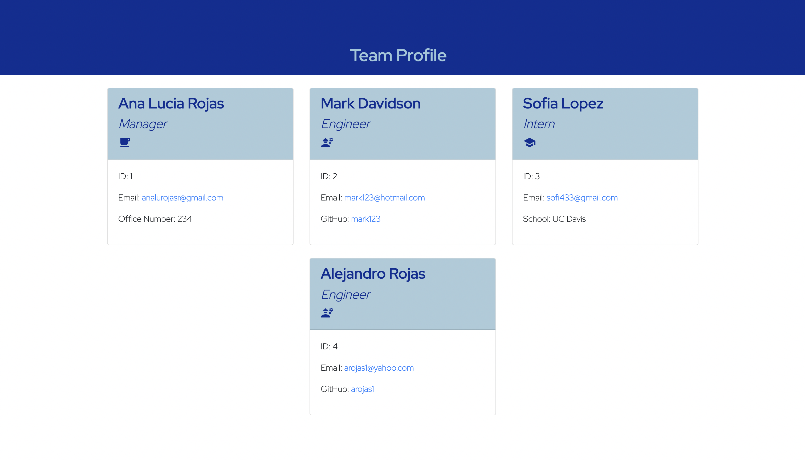

# 10.-Object-Oriented-Programming-Challenge-teamArray-Profile-Generator

## Description

This project consisted on creating a Node.js command-line application that takes in information about employees on a software engineering team and generates an HTML webpage that displays summaries for each person. Also including tests for each part of the code ensuring it passes all of them. 

## Table of Contents

* [Installation](#installation)
* [Usage](#usage)
* [Snippets](#snippets)
* [Technologies](#technologies)
* [Preview](#preview)
* [Links](#links)

## Installation 

In order to use this application please install inquirer typing this into your command line. 

```  
npm install inquirer     
```  
Also, for tests please make sure you have jest installed. 
## Usage 

After installing npm inquirer, from the index.js file use the vs code integrated termial and type node index. Enter the requiered fields and answer properly. Finally, the corresponding HTML file will be created and stored in the ./dist folder.

## Snippets 

* **a**
```            

```   
* **a**
```            

```  
* **a**
```            
 
```           


## Technologies

* JavaScript
* Node.js
* Inquirer
* Jest 

## Preview

This is a an image of a team profile deployed HTML file using this application.  



## Links

* [URL of the Youtube walktrough video]()

* [URL of the GitHub repository](https://github.com/analuciarojas/9.-Node.js-Challenge-Professional-README-Generator)